# 🌌 Cosmic Portfolio Redesign Plan - FEConf Inspired

> **Vision**: Create a professional cosmic portfolio that blends FEConf's clean, modern layout with orbital app navigation and smooth space-themed animations.

## 📋 Table of Contents
1. [Architecture Overview](#architecture-overview)
2. [Design Philosophy](#design-philosophy)
3. [Technical Implementation](#technical-implementation)
4. [Content Strategy](#content-strategy)
5. [File Structure](#file-structure)
6. [Animation Specifications](#animation-specifications)
7. [Mobile Responsiveness](#mobile-responsiveness)
8. [Performance Considerations](#performance-considerations)

---

## 🏗️ Architecture Overview

```mermaid
graph TD
    A[🌟 Hero Landing - Animated Logo/Name] --> B[🚀 Clean Bio Section]
    A --> C[🌍 Orbital App Navigation Hub]
    C --> D[🌱 VeggieLens Planet Page]
    C --> E[🔮 Future App Slots]
    
    D --> F[📱 App Details with Live Data]
    D --> G[⚖️ Integrated Legal Pages]
    
    B --> H[🎯 Skills & Journey Section]
    A --> I[📧 Clean Contact Section]
    
    style A fill:#8B5CF6,stroke:#fff,stroke-width:2px
    style C fill:#10B981,stroke:#fff,stroke-width:2px
    style D fill:#06B6D4,stroke:#fff,stroke-width:2px
```



### Site Navigation Flow


---

## 🎨 Design Philosophy

### Core Principles
- **Professional First**: Clean, business-ready presentation
- **Cosmic Enhancement**: Subtle space theme that doesn't overpower
- **Smooth Interactions**: FEConf-level animation quality
- **Modern Layout**: Contemporary web design practices
- **Mobile-Optimized**: Responsive design for all devices

### FEConf-Inspired Elements
- **Clean Typography**: Bold, modern fonts with cosmic gradients
- **Smooth Animations**: GSAP-powered entrance animations
- **Dark Theme with Strategic Colors**: Professional dark background with cosmic highlights
- **Geometric Layout**: Clean structure with space-inspired shapes
- **Subtle Interactive Elements**: Professional hover effects with cosmic touches

### Cosmic Theme Integration
- **Orbital Navigation**: Apps as planets in professional card containers
- **Gentle Space Ambience**: Subtle background without overwhelming content
- **Smooth Particle Systems**: Refined floating elements using GSAP
- **Professional Color Palette**: Cosmic gradients applied strategically

---

## ⚡ Technical Implementation

### Phase 1: Foundation & Structure
```
Priority: HIGH | Timeline: Day 1
```
- **Homepage Restructure**: Create clean layout inspired by FEConf
- **Navigation System**: Implement smooth scroll navigation
- **Base Styling**: Set up modular CSS architecture
- **Typography System**: Implement FEConf-inspired font hierarchy

### Phase 2: Animation Framework
```
Priority: HIGH | Timeline: Day 1-2
```
- **GSAP Integration**: Add professional animation library
- **Hero Animations**: Implement animated logo/name reveal
- **Scroll Triggers**: Add smooth scroll-based animations
- **Orbital System**: Create gentle orbital animations for app cards

### Phase 3: App Navigation Hub
```
Priority: MEDIUM | Timeline: Day 2-3
```
- **App Cards**: Design professional containers with cosmic elements
- **Hover Effects**: Implement smooth interactive states
- **Orbital Motion**: Add subtle rotational animations
- **Navigation Logic**: Create smooth transitions to app pages

### Phase 4: Content Integration
```
Priority: MEDIUM | Timeline: Day 3-4
```
- **Bio Section**: Create clean about section with cosmic flair
- **Skills Visualization**: Implement constellation-style skill display
- **Contact Section**: Design professional contact interface
- **Content Management**: Structure for easy content updates

### Phase 5: VeggieLens Planet Page
```
Priority: HIGH | Timeline: Day 4-5
```
- **Dedicated App Page**: Create immersive app showcase
- **Live API Integration**: Enhance existing iTunes API implementation
- **Legal Hub Integration**: Seamlessly integrate terms, privacy, support
- **App Store Buttons**: Professional download interface

---

## 📝 Content Strategy

### Hero Section
- **Animated Name/Logo**: "Shubham Raj" with cosmic gradient reveal
- **Professional Tagline**: "Software Engineer & Problem Solver"
- **Mission Statement**: "Transforming everyday challenges into elegant app solutions"

### Bio Section
- **Background**: Brief professional journey
- **Philosophy**: "Building solutions for everyday problems"
- **Skills Constellation**: Visual representation of key technologies
- **Approach**: Problem-solving methodology

### Orbital App Hub
- **VeggieLens**: "AI Food Scanner - Know what you eat instantly"
- **Future Apps**: Expandable slots for upcoming projects
- **Interactive Elements**: Hover reveals, smooth transitions
- **Professional Presentation**: Clean cards with cosmic touches

### App Planet Pages
- **Hero Showcase**: App icon with orbital design elements
- **Live Metrics**: Real-time App Store data integration
- **Feature Gallery**: Interactive feature demonstrations
- **User Testimonials**: Professional review presentation
- **Download Interface**: Prominent, accessible app store buttons

---

## 📁 File Structure

```
├── index.html                     # Main homepage
├── COSMIC-PORTFOLIO-REDESIGN-PLAN.md # This plan document
├── 
├── apps/
│   └── veggieLens/
│       ├── index.html            # VeggieLens planet page
│       ├── terms.html            # Terms of service
│       ├── privacy.html          # Privacy policy
│       └── support.html          # Support center
│
├── assets/
│   ├── css/
│   │   ├── cosmic-modern.css     # Main styling system
│   │   ├── animations.css        # GSAP animations
│   │   └── responsive.css        # Mobile optimizations
│   │
│   ├── js/
│   │   ├── gsap-animations.js    # Hero and scroll animations
│   │   ├── orbital-system.js     # App navigation mechanics
│   │   ├── api-integration.js    # iTunes API enhancements
│   │   └── main.js               # Core functionality
│   │
│   └── images/
│       ├── cosmic-bg/            # Background elements
│       ├── app-icons/            # App logos and icons
│       └── ui-elements/          # Interface graphics
```

---

## 🎬 Animation Specifications

### Hero Section Animations
```javascript
// GSAP Timeline Sequence
1. Logo/Name fade-in with scale (0.8s)
2. Tagline slide-up with stagger (0.6s)
3. Mission statement reveal (0.4s)
4. CTA buttons appear with bounce (0.3s)
```

### Orbital App Animations
```javascript
// Orbital Mechanics
- Continuous gentle rotation (20s duration)
- Hover: Scale up (1.1x) + glow effect
- Click: Smooth zoom transition to app page
- Mobile: Simplified floating animation
```

### Scroll-Triggered Effects
```javascript
// Progressive Reveal System
- Bio section: Slide-up on scroll
- Skills constellation: Staggered dot connections
- Contact cards: Scale-in with delay
- Footer: Fade-in from bottom
```

### Page Transitions
```javascript
// Navigation Animations
- Smooth scroll between sections (1.2s ease-out)
- App page entry: Scale-in from orbital position
- Back navigation: Reverse zoom effect
- Mobile: Slide transitions
```

---

## 📱 Mobile Responsiveness

### Breakpoints
```css
/* Mobile First Approach */
Mobile: 320px - 768px
Tablet: 768px - 1024px
Desktop: 1024px+
```

### Mobile Optimizations
- **Simplified Orbital Motion**: Gentle floating instead of full orbits
- **Touch-Friendly Interactions**: Larger tap targets, swipe gestures
- **Optimized Typography**: Responsive font scaling
- **Reduced Animations**: Performance-conscious motion design
- **Streamlined Layout**: Single-column design for narrow screens

### Tablet Adaptations
- **Enhanced Orbital System**: Semi-orbital motion with touch support
- **Gesture Integration**: Swipe between app cards
- **Balanced Layout**: Two-column sections where appropriate
- **Interactive Elements**: Hover states adapted for touch

---

## ⚡ Performance Considerations

### Animation Optimization
- **GPU Acceleration**: Use transform and opacity for animations
- **RAF (RequestAnimationFrame)**: Smooth 60fps performance
- **GSAP Optimization**: Lazy loading and efficient timelines
- **Reduced Motion**: Respect user accessibility preferences

### Loading Strategy
- **Critical CSS**: Inline essential styling
- **Progressive Enhancement**: Works without JavaScript
- **Image Optimization**: WebP format with fallbacks
- **Lazy Loading**: Deferred loading of non-critical assets

### Bundle Optimization
- **GSAP Selective Import**: Only load required plugins
- **CSS Modularity**: Component-based styling
- **JavaScript Chunking**: Separate core and enhancement scripts
- **Asset Compression**: Optimized file sizes

---

## 🚀 Implementation Roadmap

### Sprint 1: Foundation (Days 1-2)
- [ ] Set up new file structure
- [ ] Implement GSAP animation framework
- [ ] Create hero section with FEConf-inspired animations
- [ ] Design clean bio section with cosmic gradients

### Sprint 2: Navigation Hub (Days 3-4)
- [ ] Build orbital app navigation system
- [ ] Implement smooth scroll and page transitions
- [ ] Create professional app cards with cosmic elements
- [ ] Add interactive hover effects

### Sprint 3: Content & Polish (Days 5-6)
- [ ] Develop VeggieLens dedicated planet page
- [ ] Integrate enhanced iTunes API functionality
- [ ] Implement legal hub system
- [ ] Mobile responsiveness optimization

### Sprint 4: Testing & Launch (Day 7)
- [ ] Cross-browser testing
- [ ] Performance optimization
- [ ] Accessibility audit
- [ ] Final content review and launch

---

## 🎯 Success Metrics

### Technical Goals
- **Performance**: Lighthouse score 90+ across all categories
- **Accessibility**: WCAG 2.1 AA compliance
- **Mobile**: Smooth 60fps animations on mobile devices
- **Browser Support**: Modern browsers (Chrome 90+, Firefox 88+, Safari 14+)

### User Experience Goals
- **Engagement**: Increased time on site
- **Navigation**: Intuitive app discovery flow
- **Professional Appeal**: Business-ready presentation
- **Memorable Design**: Unique cosmic orbital concept

---

## 📞 Next Steps

1. **Review Plan**: Ensure all requirements are captured
2. **Switch to Code Mode**: Begin implementation
3. **Start with Foundation**: Hero section and basic structure
4. **Iterate and Refine**: Continuous improvement during development
5. **Test and Deploy**: Launch the cosmic-professional portfolio

---

> **Note**: This plan combines the best of both worlds - FEConf's professional modern design with your unique cosmic orbital app navigation concept. The result will be a memorable, functional portfolio that stands out while maintaining professional credibility.